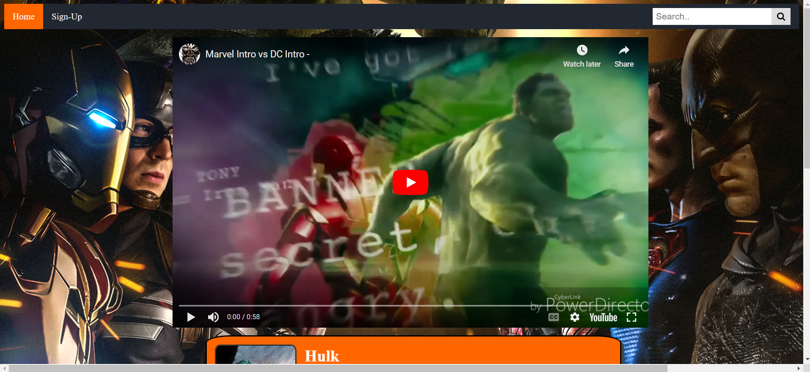
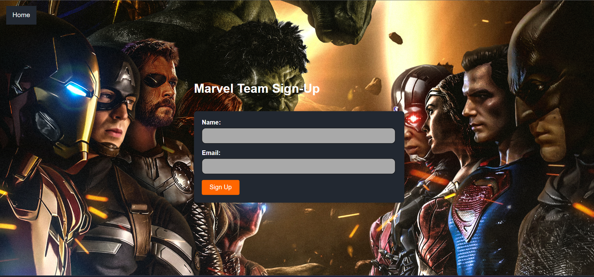

# Marvel-vs-DC

## Description

Provide a short description explaining the what, why, and how of your project. Use the following questions as a guide:

- The motivation for this web application was to provide a platform for fans of Marvel and DC comics and movies to explore details of their favorite superhero or villain.
- We created this web application becasue we want fans to come to a centralized hub to access content, stay up to date with the latest news and explore trailers effortlessly.
- This project solves the problem of scattered information and content.
- While working on this project, my parnters and I learned how to create a responsive web application using HTML, CSS, and JavaScript.

## Table of Contents

- [Home](#Home)

- [Sign-up](#Sign-up)

## Home

